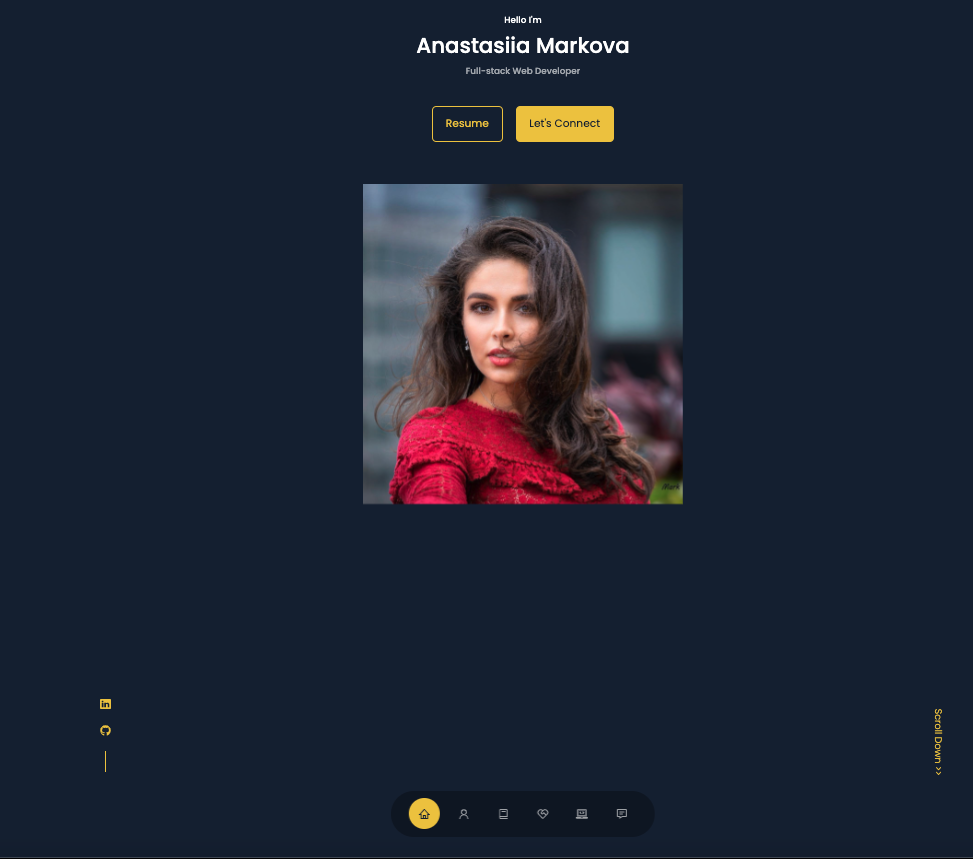

<h1 align="center">React Portfolio</h1>

## Description
Deployed React portfolio of work samples, about me, contact. single-page application portfolio for a full stack web developer

    
## Table of Content
- [Installation](#installation)
- [Usage](#usage)
- [Contributions](#contribution)
- [Licenses](#licenses)
- [Questions](#questions)
- [website link](https://mriya20.github.io/portfolio/) // Checkout the deployed website 
    
        
## Installation
To set up and utilise this project. Take the following steps.

- Step 1: Clone this repository
- Step 2: Install dependencies by running the ``` npm install ``` command in the command line
- Step 3: Open your code editor by running the command ``` code . ```
- step 4 : run ``` npm start ``` in the terminal.

    
## Usage
A responsive, single page application for developers to showcase their skills

## Screenshot
- 


## Licenses
### MIT license
[](https://opensource.org/licenses/MIT)


## website
https://mriya20.github.io/portfolio/

## Contribution
Made with ❤️ by Anastasiia

## questions
If you have any questions about the project you can contact me via the links below
   
* 📧 [Email](mailto:anastasia19markova@gmail.com)

   
* 💻 [GitHub](https://github.com/mriya20)